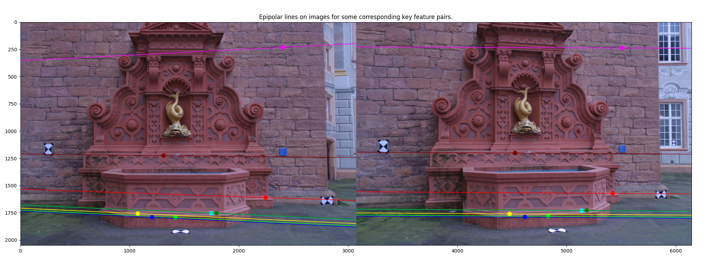
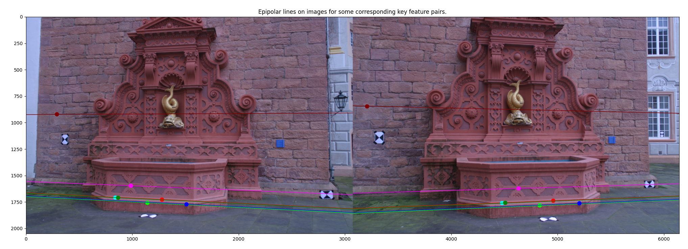
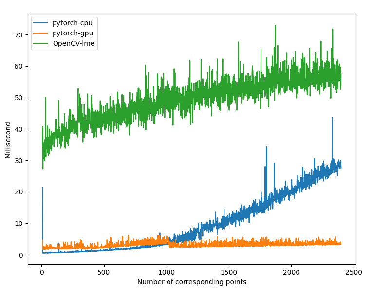

# Eight-Point Essential Matrix Estimation with PyTorch

This Python script implements the eight-point algorithm for estimating the essential matrix from corresponding points in two images, using the power of PyTorch for efficient numerical computations both in `CPU` and `GPU`. The essential matrix is a fundamental component in computer vision, used for tasks such as stereo vision, structure from motion, and camera calibration.

## Table of Contents

- [Introduction](#introduction)
- [Requirements](#requirements)
- [Usage](#usage)

## Introduction

The eight-point algorithm is a widely used method for estimating the essential matrix, which encodes the geometric relationship between two camera views of a scene. Given corresponding points in two images and camera matrices, the algorithm computes the essential matrix that describes the relative pose between the two camera views.

This algorithm is implemented in Python using the PyTorch library for efficient numerical computations, enabling seamless execution on both `GPUs` and `CPUs`.

This figure provides an illustration of epipolar lines being computed across two images for a given collection of matching points:
<p align="center">
  
</p> 
<p align="center">
  
</p> 

This graph depicts the relationship between time and the quantity of points, showcasing the PyTorch implementation on both `CPU` and `GPU`, alongside the `OpenCV cv.findEssentialMat` using the `method=cv.LMEDS`. The exclusion of `OpenCV cv.findEssentialMat` with `method=cv.RANSAC` is due to its partial utilization of points.

<p align="center">
  
</p> 

Evidently, the PyTorch implementations on both CPU and GPU exhibit swifter performance compared to the `OpenCV cv.findEssentialMat` when employing the `method=cv.LMEDS`. Notably, as the number of points escalates, the execution time on CPU experiences a significant surge, whereas the `GPU` execution time remains relatively stable. It is noteworthy that the GPU implementation aligns with the `CPU` counterpart after approximately 1000 sets of corresponding points.

## Requirements

To run this script, you need:

- Python 3.x
- PyTorch
- Numpy

## Usage

To use the `eight_point_essential_matrix` function, follow these steps:

1. Copy the `eight_point_essential_matrix` function from the provided script.

2. Call the function with appropriate inputs:

   ```python
   img1_points = ...  # Corresponding points in image 1 (N x 2)
   img2_points = ...  # Corresponding points in image 2 (N x 2)
   camera_1_matrix = ...  # Camera matrix for image 1 (3 x 3)
   camera_2_matrix = ...  # Camera matrix for image 2 (3 x 3)

   device = torch.device("cuda" if torch.cuda.is_available() else "cpu")
   result = eight_point_essential_matrix(img1_points, img2_points, camera_1_matrix, camera_2_matrix, device=device)
   ```

3. The result will be a dictionary containing the estimated essential matrix and normalized epipoles for both images.

4. For a practical demonstration of invoking this function and subsequently computing as well as visualizing epipolar lines, please refer to the `run.py` script.
